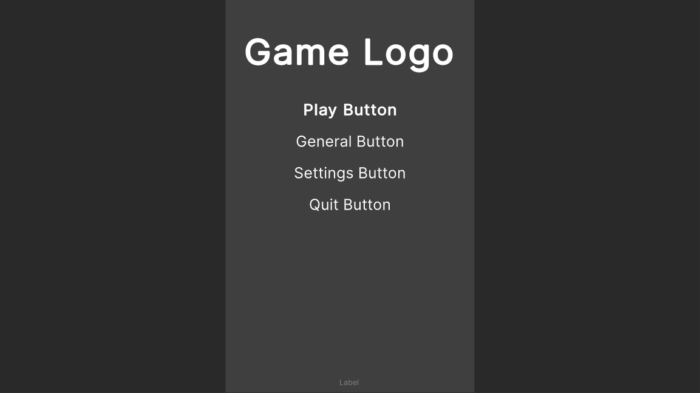
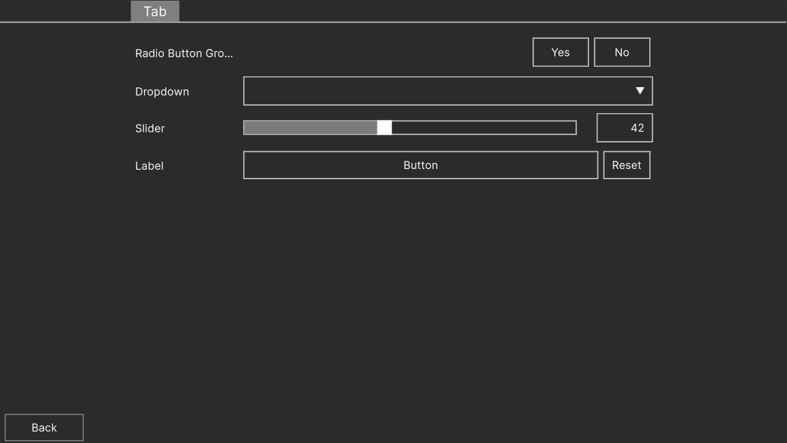

# AutoMenu
An Unity package to create a main menu and settings menu throught the editor, using UIToolkit.

## Features
- Easy setup of simple menus
- Auto generated settings menu, with premade keybinding support
- Separation of UXML structure and USS styles
- Simple customization of generated menus using USS styles
- Extension of code using Unity Events

## Simplest Menu Setup
Getting up and running with a very simple menu is quite simple. The steps are the following:
1. Add the Auto Menu Component to a Game Object
2. Use the Create Menu to create one of the premade styles and use it in the Auto Menu Component
3. Change the title and footer texts
4. Add a Play Button and a Quit Button

And just like that you should have a simple yet functional menu. If this is a main menu, do not forget that this unity scene should probably come first in the build order.

## Using Auto Settings
If you include a Settings Button in your menu buttons, a Auto Settings component will be added to your object. Here you can configure settings tabs and setting parameters to use. It even includes premade tabs for Audio, Graphics and even Keybinds (Controls).

All the parameters are stored in PlayerPrefs, and therefore, are maintained between plays.

## Using custom pages
You can still use some of AutoMenu's logic with a custom menu document. To do this, simply untoggle the `useCustomPage` property from the AutoMenu Inspector, add your custom document into the UI Document component, and include the container id onto which to add the generated buttons.

With the auto settings there is currently no way to use its logic with a custom page, so if you wish to use a custom settings page, you will have to create all its logic.

## Styling
We include both premade styles to use as a starter, and template styles with all the important selectors already present. For ease of use, we also include example documents so one can attach the styles to them in the UI Builder and edit the styles in realtime.
It is also possible to edit styles while in play mode, and they take effect immediately, but it can be harder to understand what selector is used for what.

# Documentation
## Auto Menu
### Button Types
- Play Button - Loads the scene of the selected id
- Settings Button - Adds a Auto Settings Component and uses it, if the `useCustomPage` button property is turned off.
- Quit Button - Exits the application (works in editor)
- General Button - A customizable button, extendable using Unity Events.
## Auto Settings
All the parameters in Auto Settings are saved to PlayerPrefs using the  `Auto-Settings::{prefs-key}` format. This way the values can be retrieved at runtime by other scripts.

The type of data saved to player prefs depends on the parameter. Each data type saved is the following:
- Dropdown Parameter - Int
- Bool Parameter - Int
- Slider Parameter - Float
- Control Parameter - String (json of all the rebinding overwrites)

### General Tab
This tab allows you to add any number of custom parameters.

### Graphics Tab
This tab includes simple parameters for graphics like resolution, v-sync and quality preset. These can be included by ticking the respective box.

### Audio Tab
This tab is meant for audio parameters. All it needs is the Mixer and the Exposed Parameter.

### Controls Tab
This tab is used for enabling simple key rebinding. It uses Unity Input System and currently does not work for Built In Input Manager.

The binding present for the Controls tab are the bindings in the global Input Actions Asset.

# Premade Styles
### Sleek Dark

